&nbsp;


<style>
  .col2 {
    columns: 2 200px;         /* number of columns and width in pixels*/
    -webkit-columns: 2 200px; /* chrome, safari */
    -moz-columns: 2 200px;    /* firefox */
  }
  .col3 {
    columns: 3 100px;
    -webkit-columns: 3 100px;
    -moz-columns: 3 100px;
  }
  .col4 {
    columns: 4 100px;
    -webkit-columns: 4 100px;
    -moz-columns: 4 100px;
  }
</style>

<style type="text/css">

body{ /* Normal  */
   font-size: 12px;
}
td {  /* Table  */
   font-size: 10px;
}
h1 { /* Header 1 */
 font-size: 18px;
 color: DarkBlue;
}
h2 { /* Header 2 */
 font-size: 15px;
 color: DarkBlue;
}
h3 { /* Header 3 */
 font-size: 14px;
 color: DarkBlue;
}
code.r{ /* Code block */
  font-size: 10px;
}
pre { /* Code block */
  font-size: 10px
}
</style>


***


***


***

```{r setup, include=FALSE}
library(ETest)
library(kableExtra)
library(readxl)

knitr::opts_chunk$set(echo = FALSE)

maketab <- function(dir,Alab="Statistical Area"){
  filenam = list.files(dir)
  nf = length(filenam)
  DF = data.frame(filenam)
  names(DF) = c("Area")
  #filepath = list.files(dir, full.names = T, include.dirs = T)
  fit.link = paste0('<a href=', file.path(dir, filenam), '> ', DF$Area , ' </a>')
  DF$Area <- fit.link
  DT::datatable(DF, escape=1,
                colnames=c(Alab),
                filter = 'top',
                options = list(
                  pageLength = 10, 
                  autoWidth = TRUE,
                  sDom  = '<"top">lrt<"bottom">ip'))
}


plotatab <- function(filey,sheet,head=T){
  if(head){
    dat = read_xlsx(paste0(getwd(),"/",filey),sheet)
    kable(dat,"simple") 
  }else{
    dat = read_xlsx(paste0(getwd(),"/",filey),sheet,col_names=F)
    kable(dat,"simple",col.names=rep("",ncol(dat))) 
  }
}


getprojectinfo<-function(page){
  tab=as.data.frame(read_excel("project_Info/Status Assumptions To do.xlsx", sheet = page))
  tab=tab[,2:3]
  tab[is.na(tab)]=""
  kable(tab,"simple")#,col.names=rep("",2)) 
}
  

getprog<-function(page){
  tab=as.data.frame(read_excel("Project_Info/Progress.xlsx", sheet = page))
  tab=tab[,2:3]
  tab[is.na(tab)]=""
  kable(tab,"simple")#,col.names=rep("",2)) 
}
 

```


## Disclaimer

The following work is preliminary and subject to ongoing investigation.   

These analyses do not necessarily reflect the point of view of ICCAT or the FAO and in no way anticipate ICCAT or FAO future policy.

***


## Objective

Develop a flexible and powerful indicator of stock status for tunas, billfish and sharks that can be tested theoretically and empirically. 

***


## Project Details

Title: 'Simulation Testing Ecosystem Indicators: Support to ICCAT's Ecosystem Approach to Fisheries Management (EAFM)'

```{r ProjDets, eval=T}
dat<-data.frame(c("Term","Funding body","Funding stream","Call No.","Project Partners","Blue Matter Team","ICCAT Collaborators"),
                
                 c("Dec 2023 - June 2026",
                   "International Commission for the Conservation of Atlantic Tunas (ICCAT)",
                   "FAO Global Environmental Facility (GEF) Common Oceans ABNJ Tuna Project Fund",
                   "# 11903 / 2023",
                   "Blue Matter Science Ltd.",
                   "Tom Carruthers, Adrian Hordyk, Quang Huynh",
                   "Nathan Taylor"))

kable(dat,"simple",col.names=rep("",2)) 

```

***


## Introduction

To meet the requirements of the precautionary approach and the ecosystem approach to fisheries management (EBFM), indicators of stock status are needed for secondary species, defined here as those lack sufficient data or capacity to conduct routine stock assessments (see Carruthers et al. 2024 for a detailed problem statement). Any such indicator be sound theoretically and should be validated empirically.  

The EcoTest project aims to use simulation modelling to identify data types and algorithms that can inform stock status of secondary species and then validate these indicators empirically in cases where there have been defensible stock assessments. 

A well-documented, defensible and transparent framework is needed to support tactical decision making to move beyond the single species assessment paradigm and make progress towards the essential goals of EBFM.
 
Previous EcoTest research consolidated the dynamics of six stock assessments for species caught in the North Atlantic longline fisheries (swordfish, bigeye tuna, albacore tuna, shortfin mako shark, white marlin and blue marlin) into a multi-species, multi-fleet operating model (Huynh et al. 2022). Those models were used to simulate various future scenarios for fishing and stock dynamics to develop Indicator 1: an indicator specific to the longline case study that could predict stock status for those 6 species without undergoing a full stock assessment (Carruthers et al 2024). The performance of Indicator 1 was generally very good, but it was applicable only to the 6 species of the operating model. 

A key advance in developing Indicator 1 was the use of deep learning to train neural network indicators. The large number of simulated fisheries provided both true, simulated stock status and also a wide range of possible input data types (features). This training dataset was essentially a large table, including more than 20 thousand fishery simulations. Each line representing a simulation. The first column contained the true, simulated stock status, the remaining 450+ columns were 'features' - potential data inputs that could be available in a real fishery setting for estimating stock status. 

In the EcoTest framework, the training dataset serves as a central resource for testing indicators. If for a real stock 15 data inputs (features) are available, the training dataset can be subsetted and neural networks trained for that set of inputs to see whether in theory those data could provide sufficient information about stock status. Hence EcoTest has a theoretical test of a proposed indicator built-in. The flexibility of neural networks alleviates the need to specify and code bespoke fishery dynamics models for every possible combination of input data. For example, a neural network indicator can be trained on (and use for prediction) only catches and mean lengths or alternatively, recent CPUE indices and recent catches. The focus is on the performance of the indicator. 

The ETest package is built around Indicator 2: an evolution of the original approach, that includes a testing dataset from a much more general set of simulations encompassing population and fishing dynamics for a wide range of pelagic highly migratory species (sharks, billfish and tunas) [Carruthers & Taylor 2025](https://www.iccat.int/Documents/CVSP/CV082_2025/n_6/CV082060109.pdf) 
. 


***

## Overview of the EcoTest Approach

### Propose a Suite of Data Inputs

EcoTest can accept a range of data inputs (features) that may be available for secondary species derived from data streams such as total annual catches, CPUE indices, mean length in catches and mean age in catches. These can be provide along with life-history (e.g. somatic growth, natural survival) and fleet-specific (e.g. selectivity) characteristics to potentially improve reliability in interpreting these data inputs.  

Where multiple fleets can be identified, data inputs can be provided for up to 3 individual fleets. 

Where multiple stocks can be assumed to have been exploited by a common fishery with comparable exploitation history, multi-stock data inputs can be used including catch ratios of one stock to another. 


### Format Data Inputs for Use with EcoTest Neural Networks

A training dataset was generated from a large number of multi-stock, multi-fleet simulations spanning a range of life-histories and fishery dynamics typical for tuna, billfish and sharks. In each simulation more than 400 data inputs were calculated along with the known, true simulated stock status (spawning biomass relative to spawning biomass at MSY levels). The data inputs relate to trajectories, levels and variability of data such as catches, CPUE indices and mean length in catches and are processed and formatted in such a way that they can be calculated for any fishery (e.g. mean lengthin catches is phrased as a percentage of asumptotic length, slopes in data are slopes in log data etc). 

Some data inputs relate to data from fishing fleets, some relate to fishery characteristics, and others relate to the life hsitory of the stock(s) (see Table 1). 


### Train an Artificial Neural Network for the Specified Data Inputs

The large training dataset is subsetted to include only those data inputs provided by the user. An artificial neural network is then trained on the substted training dataset. 

During training a validation dataset is used to check for model overparameterization and confirm predictive ability for independent data not used by the training algorithm.

After training, the expected indicator performance is evaluated according to a completely independent testing dataset. 

This step can be seen as (a) a theoretical check that there is information in the features (input data) provided  to estimate stock status and (b) a quantitative theoretical evaluation of the expected performance of the indicator.  

A result of this step is a fitted model and also a standardized version of the user's dataset that has the same standardization process as the training dataset. 


### Estimate Stock Status Using the Indicator

The product of step 3 (fitted model and standardized version of the dataset) can be used to estimate stock status. 

If a historical trend in empirically estimated stock status is provided, the estimates of the indicator can be compared with other empirical estimates such as those arising from stock assessments.  

***


## Installation

### R and RStudio

The Keras, Tensorflow and Miniconda libraries on which EcoTest methods are based are highly sensitive to the version of R and RStudio. 

It is therefore <u>highly</u> recommended that users install the very latest version of R and RStudio before continuing (you will almost certainly have difficulties otherwise). 

R can be downloaded from the [R Project for Statistical Computing webpage](https://cloud.r-project.org/).

Currently the ETest package is compatible with R version `r R.Version()$version.string`. 

RStudio can be downloaded from the [Posit webpage](https://www.rstudio.com/).

Currently the ETest package is working in RStudio version 2025.05.1 Build 513. 

The ETest package has only been tested on a Windows x64 system.  


### Installing R Packages

Open RStudio and run the following lines of code at the R command prompt: 

```{r Installation, eval=F,echo=T}
# Keras, Tensorflow, Miniconda
install.packages("keras3")
library(keras3)
install_keras()

# EcoTest package ETest
install.packages("remotes")
remotes::install_github('blue-matter/ETest')
```


### Test Installation

To test your installation run the following code

```{r Test_Install, eval=F,echo=T}
library(ETest)
test = train_ind(Shark_1_data)
```

If your packages are working you should see something like this:


***


## Worked Examples

### Quick Start

Lets just assume we have some data on catches, recent CPUE and a bit of life history info. Remember, these names have to match the EcoTest codes for indicator features (see Table 1 below). 

```{r Quick_start_train, eval=F,echo=T}
library(ETest)

dat = data.frame(
  K_s1 = 0.25,         # von B. somatic growth (stock 1)
  M_K_s1 = 1.05,       # Instantaneous natural Mort. / von B. K (stock 1)
  L50_Linf_s1 = 0.74,  # Length at 50% maturity (spawning fraction) / asymptotic length (L-infinity) (stock 1)
  maxa_s1 = 11,        # Age at 5% survival (stock 1)
  L5_L50_s1_f1 = 0.2,  # Shortest length at 5% selectivity relative to length at 50% maturity (stock 1)
  C_rel_s1_f1 = 0.67,  # Current catches relative to historical average (stock 1, fleet 1)
  C_g10_s1_f1 = 0.01,  # Slope in log catches over the last 10 years (stock 1, fleet 1)
  I_rel_s1_f1 = 0.43,  # Current CPUE relative to historical average (stock 1, fleet 1)
  I_g20_s1_f1 = -0.09, # Slope in log CPUE over the last 20 years (stock 1, fleet 1)
  ML_rel_s1_f1 = 0.9   # Current mean length in catches relative to historical average (stock 1, fleet 1)
)

input = list(dat=dat)
my_indicator = train_ind(input)

```

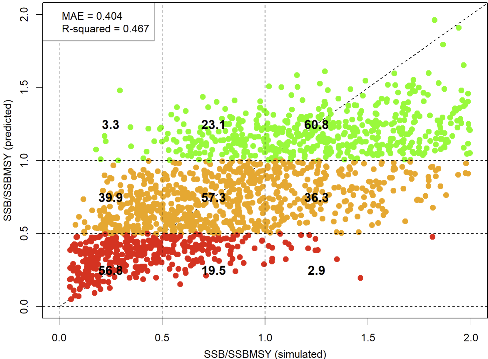

You can see that the performance of this indicator isn't stellar however it correctly classifies stocks below half SSBMSY (an ICCAT limit reference point) and above SSBMSY (an ICCAT target reference point) in about 60% of simulations. 

For now we are going to assume we find this acceptable (you might well not!). 

We can now obtain a point estimate of stock status using our indicator and the dataset provided: 

```{r Quick_start_est, eval=F,echo=T}

my_pred = pred_ind(my_indicator)
my_pred

```

Since only one set of data were provided there is only a point estimate of stock status. However most datasets can be sampled to provide stochastic inputs (bootstrapping etc). 

For the purposes of demonstration lets just create some samples of data so you can plot indicator estimates that include uncertainty:

```{r Quick_start_stoch, eval=F,echo=T}
nsamp = 50                                                  # 50 stochastic draws of the dataset
nobs = ncol(dat)                                            # data set has nobs features (data types)
log_norm_err = rlnorm(nobs*nsamp,0,0.2)                     # demo error 
data_repped = rep(as.numeric(dat),each=nsamp)               # duplicate data for nsamp rows
dat_s = array(data_repped * log_norm_err,c(nsamp,nobs))     # combine data with errors
dat_s = as.data.frame(dat_s)                                # make into data frame
names(dat_s) = names(dat)                                   # make sure to copy over labels

input_s = list(dat=dat_s)                                   # make an input object where position one in the list is the data
my_indicator_s = train_ind(input_s)                         # train the indicator
my_pred_s = pred_ind(my_indicator_s)                        # make a status prediction for each of the 50 samples of data
hist(my_pred_s, xlab="Estimated SSB/SSBMSY", main="Demonstration Stochastic Indicator", col="cornflowerblue", border="white")

```

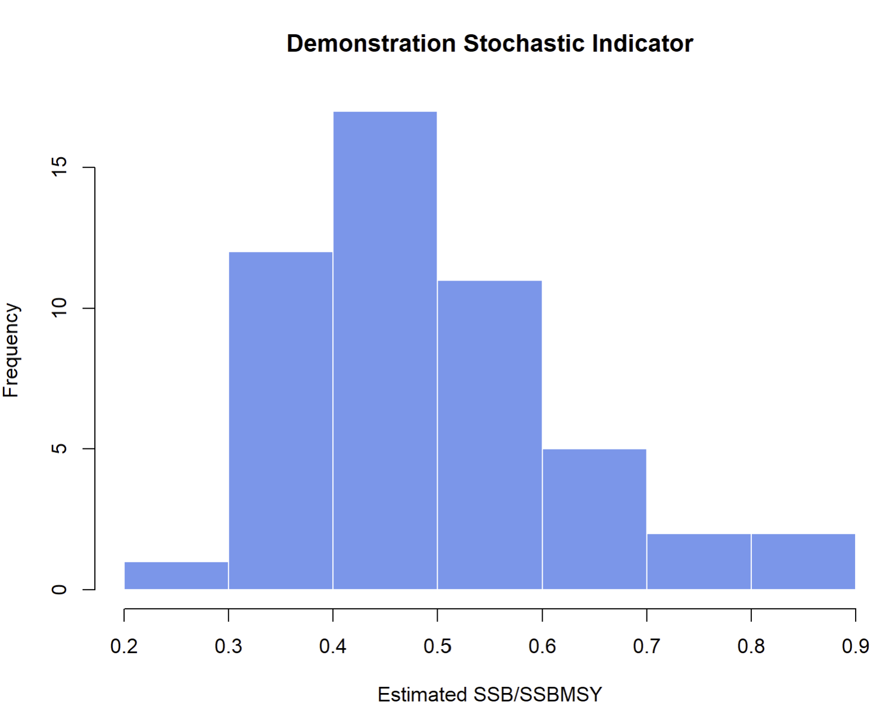


&nbsp;


### The Training Dataset and Theoretical Indicator Performance 

The training dataset 'TD' is loaded into your R session when you load the ETest library. The training dataset is very large including more than 20 thousand simulated fisheries and more than 450 features. 


```{r train_NN, eval=F,echo=T}

dim(TD)
TD[1:3, 1:20]

```

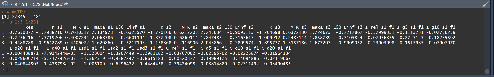

If you wish to know the theoretical performance of an indicator based on a particular set of input data you can use the train_NN(). Lets try this for the full dataset:

```{r train_NN2, eval=F,echo=T}

NN1 = train_NN(TD)

```

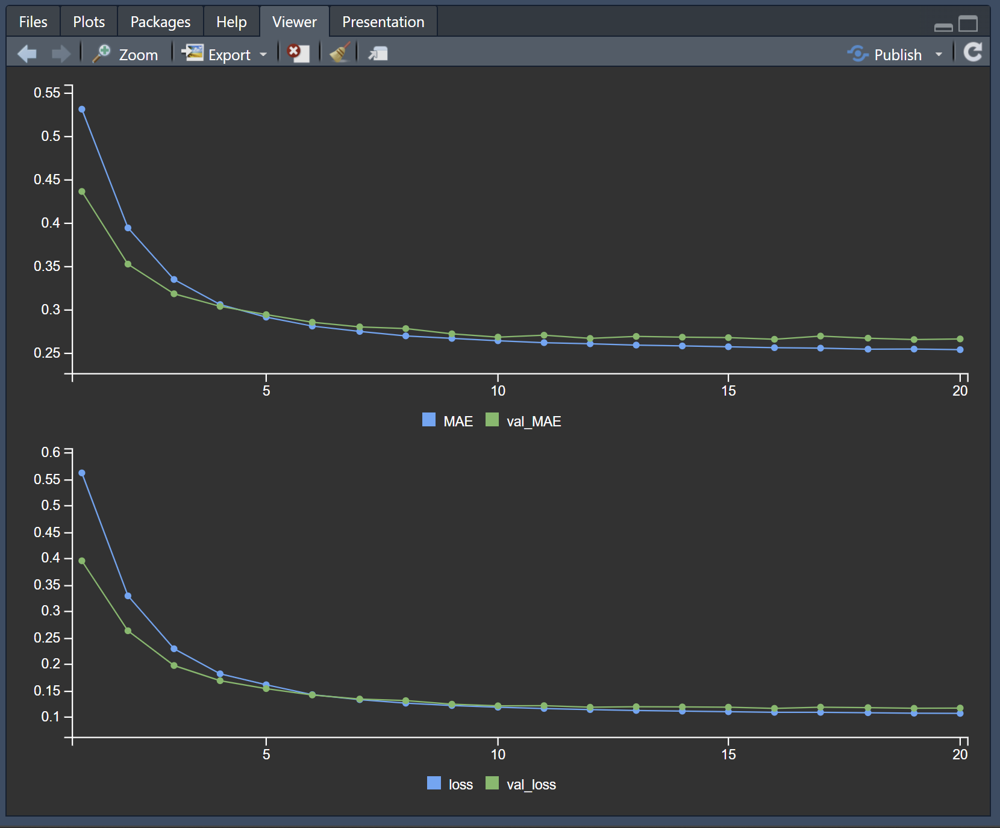

The RStudio viewer window shows the progression of the neural network training over 20 epochs (estimation iterations, passes through the backprogation algorithm). 

As the training progresses mean absolute error (MAE) and loss function (loss), on the training dataset (blue) decreases as predicted log(SSB/SSMSY) gets closer to the simulated log(SSB/SSBMSY). As the line plateaus, this indicates that the neural network is not finding a better fit to the data. 

The green line represents the MAE and loss of the validation dataset, an independent set of data not used in the training. These lines should track one another. If not it is possible that the model is over parameterized (blue line below green line) or that the validation dataset is not representative of the training dataset (see validation_split). 

The RStudio plot window shows the simulated vs predicted chart:

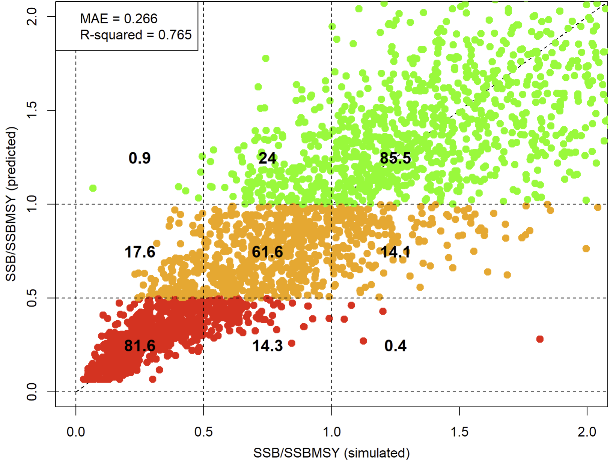

Using all the features (all of the data inputs, columns) of the training dataset we can achieve very good stock status estimation performance using the default neural network. If the stock was below half of SSBMSY then the indicator would correctly identify this in around 82% of simulations. If the stock was above SSBMSY, the indicator would correctly identify this in 85% of simulations. 

Of course we might not have access to all of those data types. Lets subset the training dataset to see how well an indicator of stock 1 status would work with only stock 1 CPUE, catch and mean length data:

```{r train_NN_sub, eval=F,echo=T}

ft = names(TD) # the names of all features
is_stock_1 = grepl("s1",ft)  # those features for stock 1 (s1 is the code)
is_ML = grepl("ML_",ft)      # those features relating to mean length
is_I = grepl("I_",ft)        # those features relating to CPUE indices
is_C = grepl("C_",ft)        # those features relating to Catch indices

keep = is_stock_1 & (is_ML | is_I | is_C)

dat_inputs = TD[,keep]

# lets make our new dataset
myTD = cbind(TD$Res,         # first column is the response variable
             TD$K_s1,        # we'll assume we know somatic growth
             TD$M_K_s1,      # we can get M/K ratio from demographic analysis
             TD$maxa_s1,     # maximum age is known (age at 5% survival)
             TD$L50_Linf_s1, # the ratio of length at 50% maturity to Linfinity is known
             dat_inputs)     # our data inputs from above
                
NN2 = train_NN(myTD)

```

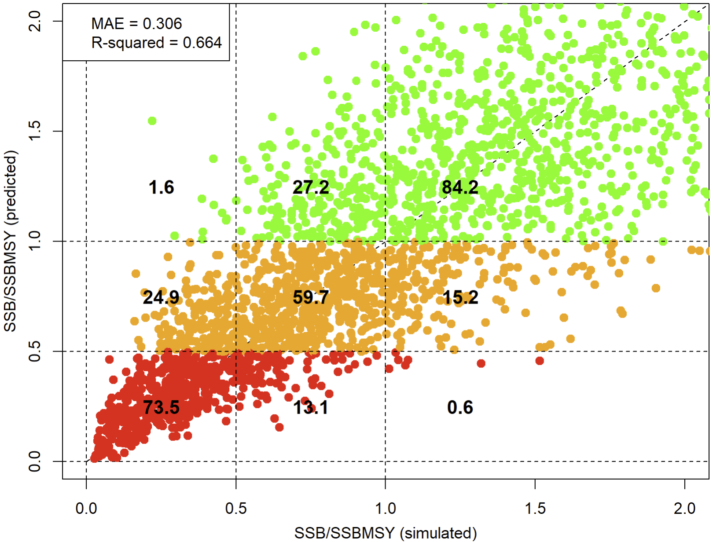

The mean absolute error of the indicator is somewhat higher and the classification errors are higher, but theoretical performance based on just catches, mean length and CPUE is relatively good. 

It's possible that a more complex neural network might provide better performance. The default is 6 nodes in the first layer and 3 in the second layer. 

This might seem like a simple neural network and compared the many billion parameter LLMs of openAI, it is. However by conventional fishery modelling standards, this simple model includes a large number of parameters (model weights). The dataset myTD has 58 features in the input layer. That means 6 * 58 weights before the first layer of nodes. There are 6 * 3 between the first and second layers and another 3 before the output layer (the response variable, log(SSB/SSBMSY)). 

That means a total of 369 parameters. 

But, lets lose our mind for a second and make a much more complicated network and fit it for longer. This one has 2360 parameters:


```{r train_NN_sub_complex, eval=F,echo=T}

NN3 = train_NN(myTD, nodes = c(30,20), nepoch = 50)

```

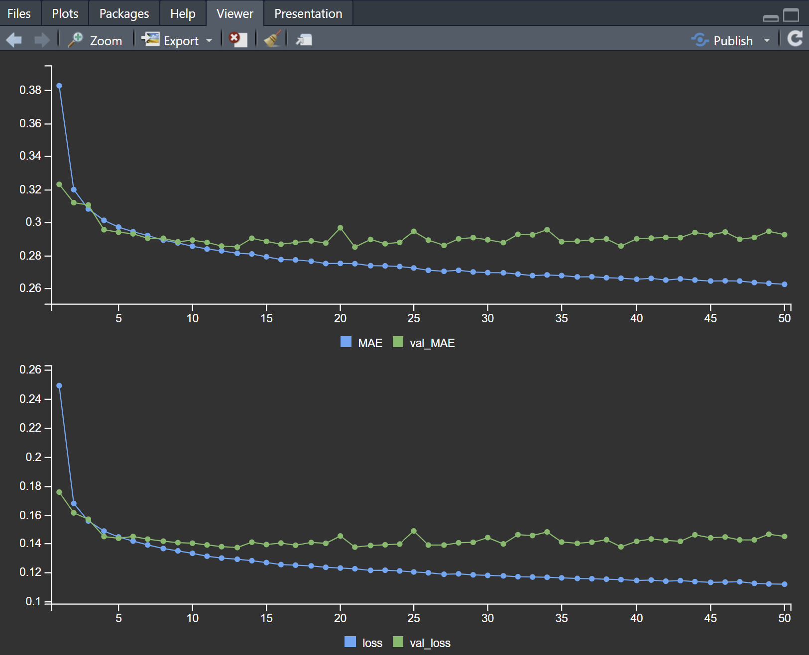

The neural network is continuing to find a better fit to the training dataset but without seeing any benefits in fit to the validation dataset. This suggests that the performance it is obtaining on the training set is not representative of what can be expected for an independent dataset. The model is over parameterized. The solution in such cases is to either simplify the model or make the training dataset larger. 


### Get an Estimate of Stock Status from Single Species Data

In this example we will process some example time series data, train an indicator and estimate stock status using it. 

The ETest package comes with an example dataset 'Some_data' for these worked examples. The dataset has catches, CPUE indices, mean length, life history and selectivity information for three fleets simultaneously fishing three fleets. We are not necessarily going to assume we have all these data, but they are there to experiment with.  

To make creating time series data inputs easier, ETest has a function ts_features() which extracts the levels and slopes processed in the same way as the training dataset.  


```{r Some_Data_proc, eval=F,echo=T}

stock = 1                                # Lets just try this for one stock and ...
fleet = 1                                #    ... one fleet. 
Catch = Some_data$Catch[stock,fleet,]    # Catch data is a 3D array [stock, fleet, year]
plot(as.numeric(names(Catch)),Catch)     # what do these catch data look like?
Catch_f = ts_features(Catch, "C")        # lets capture the rel, g5, g10, g20 and g40 features
Catch_f

Index = Some_data$Index[stock,fleet,]    # CPUE index data is a 3D array [stock, fleet, year]
Index_f = ts_features(Index, "I")        # captures the rel, g5, g10, g20 and g40 features

ML = Some_data$Mean_length[stock,fleet,] # Mean length data
ML_f = ts_features(ML,"ML")              # captures the rel, g5, g10, g20 and g40 features

fleet_data = as.data.frame(c(Catch_f, Index_f, ML_f))                  # combine fleet data
names(fleet_data) = paste0(names(fleet_data),"_s",stock,"_f",fleet)    # label correctly 

LH_sel_data = data.frame(K_s1 = Some_data$K[stock],                    # combine life history and selectivity info
                       M_K_s1 = Some_data$M[stock]/Some_data$K[stock], # ratio of M to K 
                       maxa_s1 = Some_data$maxa[stock],                # age at 5% natural survival
                       L5_L50_s1_f1 = Some_data$L5[stock,fleet]/Some_data$L50[stock],   # shortest length at 5% selectivity relative to L50
                       LFS_L50_s1_f1 = Some_data$LFS[stock,fleet]/Some_data$L50[stock]) # length at 95% selectivity relative to L50

input2 = list(data=cbind(LH_sel_data, fleet_data))                     # Combine inputs into a single input object

```
Now that we have our dataset, extracted from three time series (Catch, a CPUE index and Mean Length) in addition to selectivity and life history parameters, we can train and use the indicator:


```{r Some_data_train1, eval=F,echo=T}
my_indicator2 = train_ind(input2)  # train indicator, standardize input data

```

And then get an estimate of stock status:

```{r Some_data_pred, eval=F,echo=T}
pred_ind(my_indicator2)  # estimate stock status from trained indicator and submitted dataset

```


### Conduct Empirical Evaluation Using ETest Datasets

The ETest package comes with a number of real fishery datasets loaded. You can list these using the R function data():

```{r Some_data_train2, eval=F,echo=T}
data(package="ETest")

```
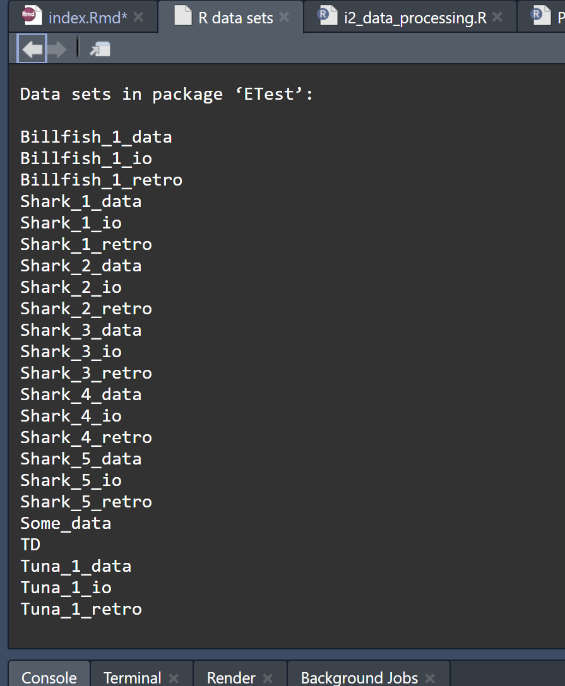

There is an object TD which is the full training dataset. You can always look at that if you want to check the magnitude and range of data inputs used for training the neural networks. 

The other objects are labelled _io, _data and _retro. 

_io objects such as Shark_1_io are list objects that contain all of the inputs and outputs to a Stock Synthesis 3 assessment. 

_data objects are list objects that contain ETest formatted features obtained from those _io stock synthesis runs (position 1, 'inputs') and also the stock synthesis estimated stock status (position 2, 'Brel'). 

_retro objects are a list of _data objects npeels long which strip back the data from the stock synthesis runs to allow retrospective behavior of indicators to be evaluated. 

Using these objects it is simple to conduct indicator training and prediction, including retrospective analysis:

```{r ET_Data, eval=F,echo=T}

# Single stock status estimate using data to most recent year:
Shark_1_ind = train_ind(Shark_1_data)
Shark_1_pred = pred_ind(Shark_1_ind)
hist(Shark_1_pred)
```
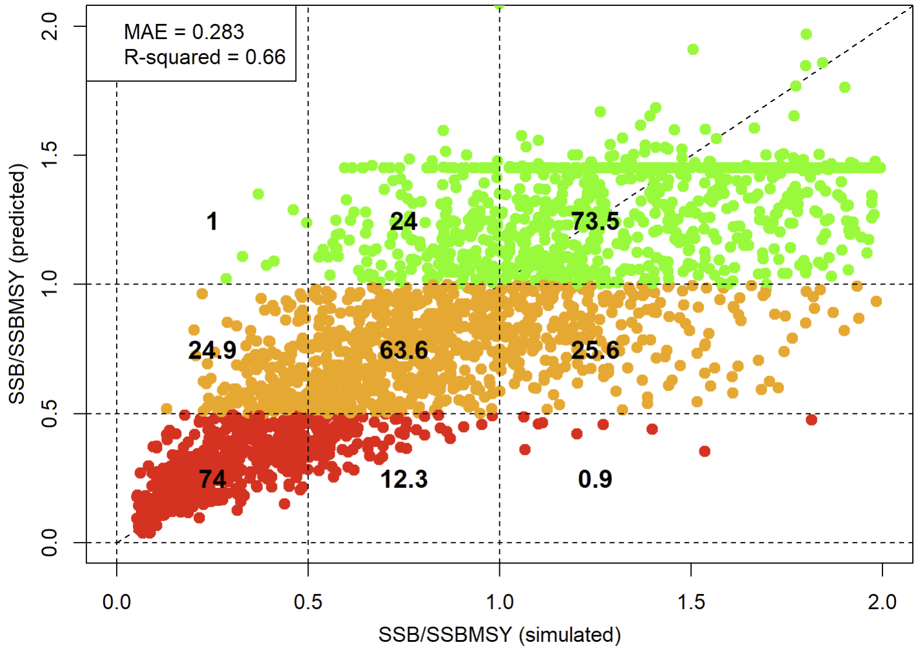

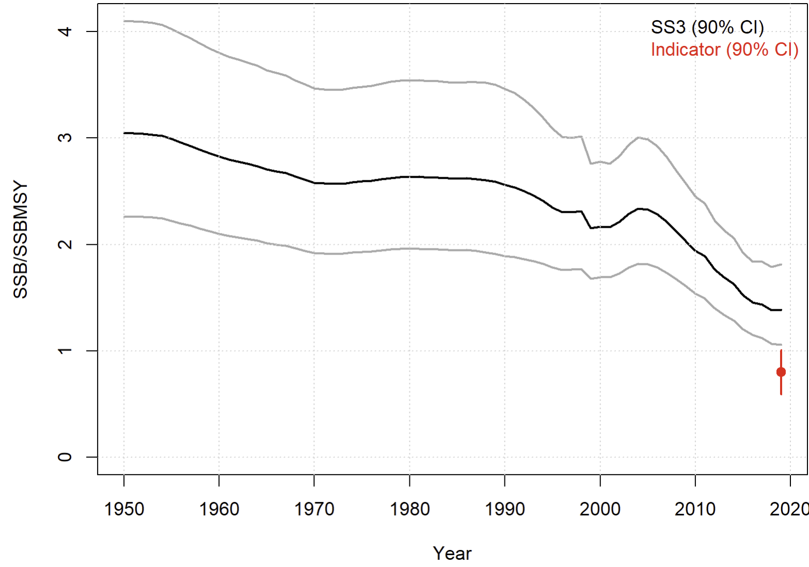

```{r ET_Data2, eval=F,echo=T}

# Retropsective stock status estimate using npeels of the SS3 data:
Shark_1_ind_retro = train_ind(Shark_1_retro)
Shark_1_pred_retro = pred_ind(Shark_1_ind_retro)

```

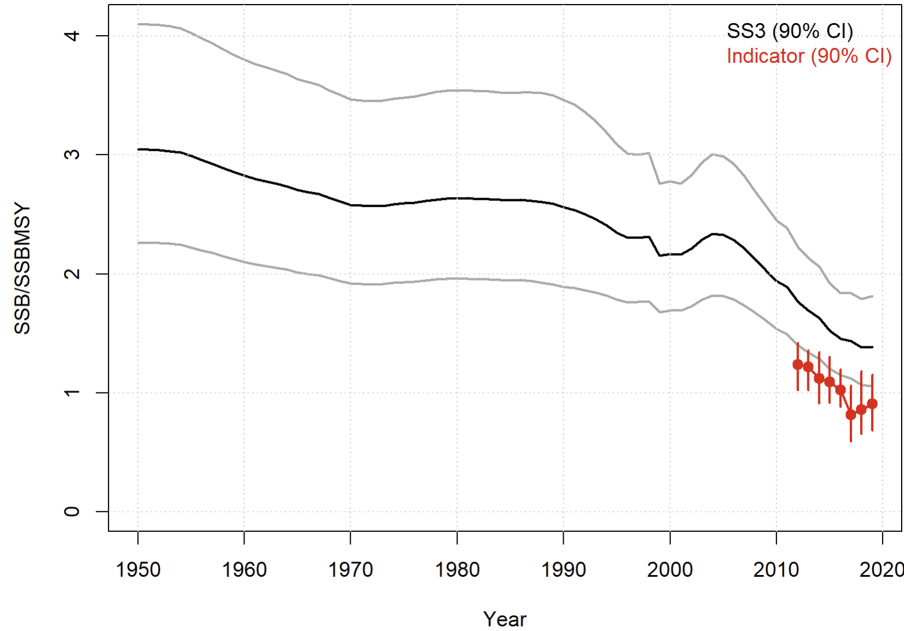


### Use an Existing Stock Synthesis Assessment to Conduct an Empirical Test

To obtain all relevant outputs for a current Stock Synthesis model you will a directory where an assessment has been run and you will need to install the latest version of the r4ss package.

```{r all_ss3, eval=F,echo=T}
wm_io = all_ss3("C:/myassessments/ATL_white_marlin_2025")

```

Once you have the assessment ripped into R, you need to pick what fleets and indices you wish to extract. You can use the ss_names() function to list the fleets / surveys. You then have to select the relevant fleets and corresponding cpue indices and then make your formatted EcoTest indicator features using SS_2_ET(): 

```{r SS_2_ET, eval=F,echo=T}
ss_names(wm_io)
wm_data = SS_2_ET(wm_io, Fnam = c("JPN_LL_N","US_PL_N"), Inam = c("Surv_JPN_LL_N","Surv_US_PL_N"))

```

The wm_data object now has features for three fleet data sets: the Japanese longline north the US pole and line north and all other fleets combined. Selectivities for all other fleets combined are weighted by historical average catches. 

The function SS_2_ET() samples from time series and parameters to provide a stochastic feature dataset in order to obtain variance in stock status estimates. 

You can now run the indicator for that dataset: 

```{r train_ind_wm, eval=F,echo=T}
wm_ind = train_ind(wm_data)
wm_pred = pred_ind(wm_ind)

```

or alternatively you can do the same steps but conduct a retrospective analysis using the function SS_2_ET_Retro():

```{r retro_wm1, eval=F,echo=T}
wm_retro = SS_2_ET_Retro(wm_io, Fnam = c("JPN_LL_N","US_PL_N"), Inam = c("Surv_JPN_LL_N","Surv_US_PL_N"),npeels=8)
wm_ind_retro = train_ind(wm_retro)
wm_pred_retro = pred_ind(wm_ind_retro)

```

### Multi-Stock Indicators

In general, fisheries stock assessment has failed to incorporate information across multiple species in the estimation of stock status. This is a missed opportunity. 

For example if the denominator of CPUE indcies of abundance (effort) is comparable in trend among two species, their catch ratio informs their *relative* depletion (e.g. if the catch ratio of stock 1 : stock 2 has declined by 50%, then this infers that stock 1 is at half the vulnerable stock size as stock 2 (assuming you standardized your data correctly).

This means that depletion on one stock may be informed by data informing depletion on the other stock. As the number of stocks increases (that adhere to this assumption of approximately comparable effort trends) an increasibly narrow set of depletion conditions may prevail. To demonstrate this lets see how well only catch data can inform stock status across three species: 


```{r retro_wm2, eval=F,echo=T}
fleet = 1                                #    ... one fleet. 
Catch_f1 = ts_features(Some_data$Catch[1,fleet,],"C")
Catch_f2 = ts_features(Some_data$Catch[2,fleet,],"C")
Catch_f3 = ts_features(Some_data$Catch[3,fleet,],"C")
cvec = c(unlist(Catch_f1),unlist(Catch_f2),unlist(Catch_f3))
msdat = data.frame(matrix(cvec,1))
names(msdat) = paste0(names(cvec),"_s",rep(1:3,each=5),"_f1")
input = list(dat=msdat)
catch_ind = train_ind(input)


```
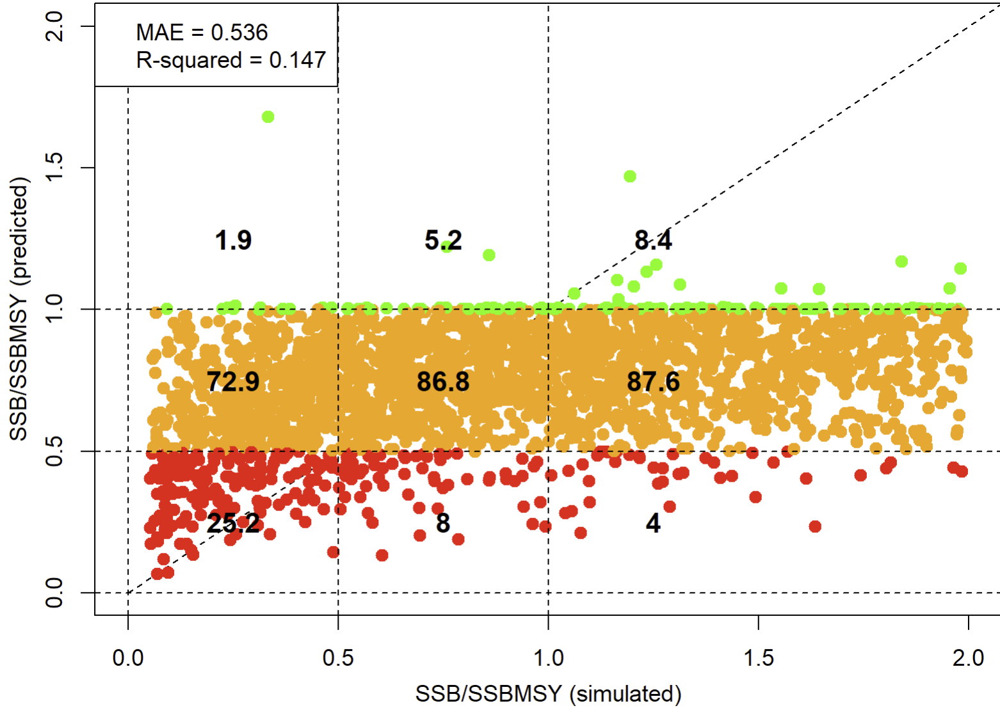

Since there is nothing providing an indication of *absolute* depletion the indicator based on catches alone performs very poorly. 

```{r retro_wm3, eval=F,echo=T}
fleet = 1   #    ... one fleet. 


Index_s1 = ts_features(Some_data$Index[1,fleet,],"I")
Index_s2 = ts_features(Some_data$Index[2,fleet,],"I")
Index_s3 = ts_features(Some_data$Index[3,fleet,],"I")
Index_rels = data.frame(I_rel_s1_f1 = Index_s1$I_rel,
                        I_rel_s2_f1 = Index_s2$I_rel,
                        I_rel_s3_f1 = Index_s3$I_rel)
wIdat = list(dat = cbind(msdat, Index_rels))
catch_wI_ind = train_ind(wIdat)


```


Adding just the current index levels relative to historical means, tidied the indicator up somewhat. 

Now lets find out how much of that was just the index levels:

```{r retro_wm4, eval=F,echo=T}

catch_onlyI_ind = train_ind(list(dat=Index_rels))


```
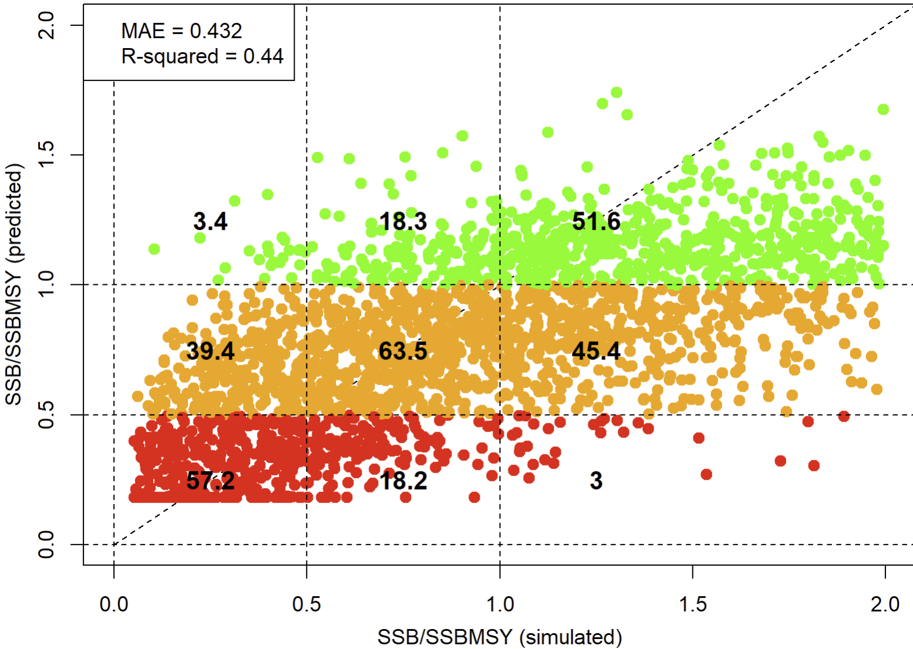

As expected, the relative index levels were doing the majority (but not all) of the lifting.


***


## Summary of EcoTest Indicator Features (data types)

To use EcoTest, you must format your input data as described in Table 1. 

Table 1. Indicator Features (data types)

```{r Features, eval=T,echo=F}
plotatab('tables/Various.xlsx','Features')

```

Any stock-specific data_input has an 's' code. Any fleet specific input has a stock and a fleet 'f' code. For example, somatic growth K for stock 1 is codified K_s1. Catches relative to historical average Crel for stock 2, fleet 1 is Crel_s2_f1. You can always list the full set of names of all the possible features by getting the names of the training dataset:

```{r Features_TD, eval=T,echo=T}
names(TD)

```


***


## Software and Code

[Rapid Conditioning Model (RCM) (Huynh 2024)](https://samtool.openmse.com/reference/RCM.html)

[OpenMSE (Hordyk et al. 2024)](https://openMSE.com)


***


## Neural Network Links

[Zhou's intro to ANN and machine learning](https://victorzhou.com/blog/intro-to-neural-networks/)

[Keras 3: Deep learning API](https://keras.io/)

[Tensorflow: Platform for machine learning](https://www.tensorflow.org/)

[Nvidia CUDA Toolkit: GPU accellerated applications](https://developer.nvidia.com/cuda-toolkit)

***


## Recent Presentations

[EcoTest Phase 3 SCRS/2024/87](\presentations\SCRS-2024-87 Carruthers et al EcoTest Phase III.pptx)

[EcoTest Indicator 2 SCRS/2025/109](\presentations\SCRS-2025-109 Carruthers Taylor EcoTest Indicator 2.pptx)


***


## References

Carruthers, T.R. 2018. A multispecies catch-ratio estimator of relative stock depletion. Fisheries Research. 197: 25-33, https://doi.org/10.1016/j.fishres.2017.09.017.

[Carruthers, T.R., & Taylor, N.G. 2025. EcoTest Indicator 2: A general purpose stock status indicator for sharks, billfish and tunas.](https://www.iccat.int/Documents/CVSP/CV082_2025/n_6/CV082060109.pdf) 

[Carruthers, T.R., Huynh, Q., Taylor, N.G. 2024. EcoTest Phase III: Simulation testing Ecosystem Indicators. SCRS/2023/087. ](https://www.researchgate.net/publication/385130368_ECOTEST_PHASE_III_SIMULATION_TESTING_ECOSYSTEM_INDICATORS)

Huynh, Q., 2025. Rapid Conditioning model. Available from [https://openmse.com/tutorial-rcm/](https://openmse.com/tutorial-rcm/) 

[Huynh, Q., Carruthers, T., Taylor, N.G. 2022. EcoTest: a proof of concept for evaluating ecological indicators in multispecies fisheries, with the Atlantic longline fishery case study. SCRS/2022/106.](https://iccat.int/Documents/CVSP/CV081_2024/n_4/CV08104087.pdf) 

Juan-Jordá, M.J., Murua, H., Arrizabalaga, H., Dulvy, N.K., and Restrepo, V. 2018. Report card on ecosystem-based fisheries management in tuna regional fisheries management organizations. Fish Fish. 19: 321-339.

***


## Acknowledgements

EcoTest is funded by ICCAT as part of a commitment to the Global Environmental Facility (GEF) Common Oceans ABNJ Tuna Project Fund.

Many thanks to The Ocean Foundation for funding Phases I and II of the EcoTest framework. 

Many thanks to the ICCAT Ecosystem working group for comments on earlier versions of EcoTest: Nathan Taylor, Alex Hanke, Sachiko Tsuji, Guillermo Diaz, Diego Alvarez, Laurie Kell, Maria Juan Jorda, Andres Domingo.  

Blue Matter: Tom Carruthers, Adrian Hordyk, Quang Huynh

OpenMSE was developed with support from the Natural Resources Defense Council (NRDC), the Gordon and Betty Moore Foundation, the Packard Foundation, the Marine Stewardship Council, Fisheries and Oceans Canada (DFO), the U.S. National Oceanic and Atmospheric Administration, the International Commission for the Conservation of Atlantic Tunas (ICCAT) and The Ocean Foundation.

OpenMSE continues to be developed with the support of the The Ocean Foundation. 


*** 


&nbsp;&nbsp;&nbsp;&nbsp;&nbsp;&nbsp;&nbsp;&nbsp;&nbsp;&nbsp;&nbsp;&nbsp;

