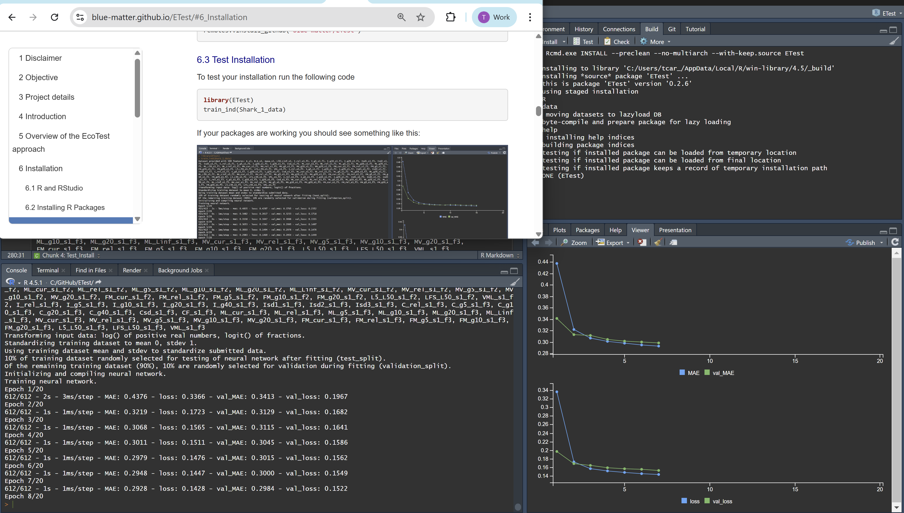

&nbsp;


<style>
  .col2 {
    columns: 2 200px;         /* number of columns and width in pixels*/
    -webkit-columns: 2 200px; /* chrome, safari */
    -moz-columns: 2 200px;    /* firefox */
  }
  .col3 {
    columns: 3 100px;
    -webkit-columns: 3 100px;
    -moz-columns: 3 100px;
  }
  .col4 {
    columns: 4 100px;
    -webkit-columns: 4 100px;
    -moz-columns: 4 100px;
  }
</style>

<style type="text/css">

body{ /* Normal  */
   font-size: 12px;
}
td {  /* Table  */
   font-size: 10px;
}
h1 { /* Header 1 */
 font-size: 18px;
 color: DarkBlue;
}
h2 { /* Header 2 */
 font-size: 15px;
 color: DarkBlue;
}
h3 { /* Header 3 */
 font-size: 14px;
 color: DarkBlue;
}
code.r{ /* Code block */
  font-size: 10px;
}
pre { /* Code block */
  font-size: 10px
}
</style>


***


***

&nbsp;


***

```{r setup, include=FALSE}
library(ETest)
library(kableExtra)
library(readxl)

knitr::opts_chunk$set(echo = FALSE)

maketab <- function(dir,Alab="Statistical Area"){
  filenam = list.files(dir)
  nf = length(filenam)
  DF = data.frame(filenam)
  names(DF) = c("Area")
  #filepath = list.files(dir, full.names = T, include.dirs = T)
  fit.link = paste0('<a href=', file.path(dir, filenam), '> ', DF$Area , ' </a>')
  DF$Area <- fit.link
  DT::datatable(DF, escape=1,
                colnames=c(Alab),
                filter = 'top',
                options = list(
                  pageLength = 10, 
                  autoWidth = TRUE,
                  sDom  = '<"top">lrt<"bottom">ip'))
}


plotatab <- function(filey,sheet,head=T){
  if(head){
    dat = read_xlsx(paste0(getwd(),"/",filey),sheet)
    kable(dat,"simple") 
  }else{
    dat = read_xlsx(paste0(getwd(),"/",filey),sheet,col_names=F)
    kable(dat,"simple",col.names=rep("",ncol(dat))) 
  }
}


getprojectinfo<-function(page){
  tab=as.data.frame(read_excel("project_Info/Status Assumptions To do.xlsx", sheet = page))
  tab=tab[,2:3]
  tab[is.na(tab)]=""
  kable(tab,"simple")#,col.names=rep("",2)) 
}
  

getprog<-function(page){
  tab=as.data.frame(read_excel("Project_Info/Progress.xlsx", sheet = page))
  tab=tab[,2:3]
  tab[is.na(tab)]=""
  kable(tab,"simple")#,col.names=rep("",2)) 
}
 

```


## Disclaimer

The following work is preliminary and subject to ongoing investigation.   

These analyses do not necessarily reflect the point of view of ICCAT or the FAO and in no way anticipate ICCAT or FAO future policy.

***

## Objective

Develop a flexible and powerful indicator of stock status for tunas, billfish and sharks that can be tested theoretically and empirically. 

***

## Project details

Title: 'Simulation Testing Ecosystem Indicators: Support to ICCAT's Ecosystem Approach to Fisheries Management (EAFM)'

```{r ProjDets, eval=T}
dat<-data.frame(c("Term","Funding body","Funding stream","Call No.","Project Partners","Blue Matter Team","ICCAT Collaborators"),
                
                 c("Dec 2023 - June 2026",
                   "International Commission for the Conservation of Atlantic Tunas (ICCAT)",
                   "FAO Global Environmental Facility (GEF) Common Oceans ABNJ Tuna Project Fund",
                   "# 11903 / 2023",
                   "Blue Matter Science Ltd.",
                   "Tom Carruthers, Adrian Hordyk, Quang Huynh",
                   "Nathan Taylor"))

kable(dat,"simple",col.names=rep("",2)) 

```

***

## Introduction

To meet the requirements of the precautionary approach and the ecosystem approach to fisheries management (EBFM), indicators of stock status are needed for secondary species, defined here as those lack sufficient data or capacity to conduct routine stock assessments (see Carruthers et al. 2024 for a detailed problem statement). These indicators must be theoretically sound and be validated empirically.  

The EcoTest project aims to use simulation modelling to identify data and algorithms that can inform stock status of secondary species and then validate these indicators empirically in cases where there have been defensible stock assessments. 

A well-documented, defensible and transparent framework is needed to support tactical decision making to move beyond the single species assessment paradigm and make progress towards the essential goals of EBFM.
 
Previous work synthesized the dynamics of six stock assessments and consolidated those into a single multi-species, multi-fleet operating model (Huynh et al. 2022). Those operating models were used to simulate various future scenarios for fishing and stock dynamics to develop Indicator 1: an indicator system specific to the longline case study that could predict stock status for the 6 species without undergoing a full stock assessment (Carruthers et al 2024). 

The key advance of this earlier work was to use deep learning to train neural networks on the posterior-predicted data of a large number of simulations (a training dataset). The ETest package is built around an evoluation of that approach, using simulated posterior predicted data from a much more general set of simulations that include population and fishing dynamics for a wide range of pelagic highly migratory species that are caught in Atlantic fisheries. 

These indicators focus on the prediction of stock status relative to a productive level expressed as spawning stock biomass relative to spawning stock biomass corresponding to MSY levels. This is a key reference level for evaluating stock status for the majority of stock assessed by ICCAT. Expert working groups also confirmed that there is interest in developing indicators that can accommodate various numbers of fleets and stocks, and that these should also apply to varying data availability scenarios with respect to length, age and relative abundance data. 

***

## Overview of the EcoTest approach

### Step 1 - Propose a suite of indicators

EcoTest can accept a range of indicators that may be available for secondary species derived from data streams such as total annual catches, CPUE indices, mean length in catches and mean age in catches. These can be provide along with life-history (e.g. somatic growth, natural survival) and fleet-specific (e.g. selectivity) characteristics to potentially improve reliability in interpreting these indicators. 

Where multiple fleets can be identified, indicators can be provided for up to 3 individual fleets. 

Where multiple stocks can be assumed to have been exploited by a common fishery with comparable exploitation history, multi-stock indicators can be used including catch ratios of one stock to another. 

### Step 2 - Format indicators for use with EcoTest neural networks

A training dataset was generated from a large number of multi-stock, multi-fleet simulations spanning a range of life-histories and fishery dynamics typical for tuna, billfish and sharks. In each simulation 426 indicators were calculated along and the known, true simulated stock status (spawning biomass relative to spawning biomass at MSY levels) was recorded. The 426 indicators relate to trajectories and levels of data such as catches, CPUE indices and mean length in catches and are processed and formatted in such a way that they are generalisable for all case studies. 

Some indicators relate to data from fishing fleets, some relate to fishery characteristics, and others relate to the life hsitory of the stock(s) (see Table 1). 


&nbsp;


### Step 3 - Train and artificial neural network for the specific suite of indicators selected by the user

The large training dataset is subsetted to include only those features of the dataset provided by the user. An artificial neural network is then trained on the dataset. 

During training a validation dataset is used to check for model overparameterization and confirm predictive ability for independent data not used by the training algorithm.

After training, the expected indicator performance is evaluated according to a completely independent testing dataset. 

This step can be seen as (a) a theoretical check that there is information in the features (data types) provided that can be used to estimate stock status and (b) a quantitative theoretical evaluation of the expected performance of the indicator.  

A result of this step is a fitted model and also a standardized version of the user's dataset that has the same standardization process as the training dataset. 


### Step 4. - Estimate stock status using the indicator

The product of step 3 (fitted model and standardized version of the dataset) can be used to estimate stock status. 

If a historical trend in empirically estimated stock status is provided, the results of indicator estimation can be compared with other empirical estimates. 


***

## Installation

### R and RStudio

The Keras, Tensorflow and Miniconda libraries on which EcoTest methods are based are highly sensitive to the version of R and RStudio. 

It is therefore <u>highly</u> recommended that users install the very latest version of R and RStudio before continuing (you will almost certainly have difficulties otherwise). 

R can be downloaded from the [R Project for Statistical Computing webpage](https://cloud.r-project.org/).

Currently the ETest package is compatible with R version `r R.Version()$version.string`. 

RStudio can be downloaded from the [Posit webpage](https://www.rstudio.com/).

Currently the ETest package is working in RStudio version 2025.05.1 Build 513. 

The ETest package has only been tested on a Windows x64 system.  


### Installing R Packages

Open RStudio and run the following lines of code at the R command prompt: 

```{r Installation, eval=F,echo=T}
# Keras, Tensorflow, Miniconda
install.packages("keras3")
library(keras3)
install_keras()

# EcoTest package ETest
install.packages("remotes")
remotes::install_github('blue-matter/ETest')
```


### Test Installation

To test your installation run the following code

```{r Test_Install, eval=F,echo=T}
library(ETest)
train_ind(Shark_1_data)
```

If your packages are working you should see something like this:





***

## Worked Examples

## Quick Start

Lets just assume we have some data on catches, recent CPUE and a bit of life history info

```{r Quick_start_train, eval=F,echo=T}
library(ETest)

dat = data.frame(
  K_s1 = 0.25,         # von B. somatic growth (stock 1)
  M_K_s1 = 1.05,       # Instantaneous natural Mort. / von B. K (stock 1)
  L50_Linf_s1 = 0.74,  # Length at 50% maturity (spawning fraction) / asymptotic length (L-infinity) (stock 1)
  maxa_s1 = 11,        # Age at 5% survival (stock 1)
  L5_L50_s1_f1 = 0.2,  # Shortest length at 5% selectivity relative to length at 50% maturity (stock 1)
  C_rel_s1_f1 = 0.67,  # Current catches relative to historical average (stock 1, fleet 1)
  C_g10_s1_f1 = 0.01,  # Slope in log catches over the last 10 years (stock 1, fleet 1)
  I_rel_s1_f1 = 0.43,  # Current CPUE relative to historical average (stock 1, fleet 1)
  I_g20_s1_f1 = -0.09, # Slope in log CPUE over the last 20 years (stock 1, fleet 1)
  ML_rel_s1_f1 = 0.9   # Current mean length in catches relative to historical average (stock 1, fleet 1)
)

input = list(dat=dat)
my_indicator = train_ind(input)

```


You can see that the performance of this indicator isn't stellar however it correctly classifies stocks below half SSBMSY (an ICCAT limit reference point) and above SSBMSY (an ICCAT target reference point) in about 60% of simulations. 

For now we are going to assume we find this acceptable (you might well not!). 

We can now obtain a point estimate of stock status using our indicator and the dataset provided: 

```{r Quick_start_est, eval=F,echo=T}

my_pred = pred_ind(my_indicator)
my_pred

```

Since only one set of data were provided there is only a point estimate of stock status. However most datasets can be sampled to provide stochastic inputs (bootstrapping etc). 

For the purposes of demonstration lets just great some samples of data so you can plot indicator estimates that include uncertainty:

```{r Quick_start_stoch, eval=F,echo=T}
nsamp = 50
nobs = ncol(dat)
dat_s = as.data.frame(array(rep(as.numeric(dat),each=nsamp)*rlnorm(nobs*nsamp,0,0.2),c(nsamp,nobs)))
names(dat_s)=names(dat)

input_s = list(dat=dat_s)
my_indicator_s = train_ind(input_s)
my_pred_s = pred_ind(my_indicator_s)
hist(my_pred_s,xlab="Estimated SSB/SSBMSY",main="Demonstration Stochastic Indicator",col="cornflowerblue",border="white")

```


## Get a point estimate of stock status from single species data

In this example we will process some example data, train an indicator and estimate stock status using it. 

The ETest package comes with an example dataset 'Some_data' for these worked examples. The dataset has catches, CPUE indices, mean length, life history and selectivity information for three fleets simultaneously fishing three fleets. We are not necessarily going to assume we have all these data, but they are there to experiment with.  

To make creating time series data features easier, ETest has a function ts_features() which extracts the levels and slopes processed in the same way as the training dataset.  


```{r Some_Data_proc, eval=F,echo=T}

stock = 1  # Lets just try this for one stock and...
fleet = 1  #   one fleet. 
Catch = Some_data$Catch[stock,fleet,] # Catch data is a 3D array [stock, fleet, year]
plot(as.numeric(names(Catch)),Catch) # what do these catch data look like?
Catch_f = ts_features(Catch, "C")  # lets capture the rel, g5, g10, g20 and g40 features
Catch_f

Index = Some_data$Index[stock,fleet,] # CPUE index data is a 3D array [stock, fleet, year]
Index_f = ts_features(Index, "I")  # captures the rel, g5, g10, g20 and g40 features

ML_f = ts_features(Some_data$Mean_length[stock,fleet,],"ML")

fleet_data = as.data.frame(c(Catch_f, Index_f, ML_f))
names(fleet_data) = paste0(names(fleet_data),"_s",stock,"_f",fleet)

LH_sel_data = data.frame(K_s1 = Some_data$K[stock],
                       M_K_s1 = Some_data$M[stock]/Some_data$K[stock],
                       maxa_s1 = Some_data$maxa[stock],
                       L5_L50_s1_f1 = Some_data$L5[stock,fleet]/Some_data$L50[stock,fleet],
                       LFS_L50_s1_f1 = Some_data$LFS[stock,fleet]/Some_data$L50[stock,fleet])

input2 = list(data=cbind(LH_sel_data, fleet_data))

```
Now that we have our dataset, extracted from three time series (Catch, a CPUE index and Mean Length) in addition to selectivity and life history parameters, we can set up the indicator:


```{r Some_data_train, eval=F,echo=T}
my_indicator2 = train_ind(input2)

```

## Conduct empirical evaluation


## Multi-stock indicators


***

## Summary of EcoTest Indicator Features (data types)


Table 1. Indicator Features (data types)

```{r Features, eval=T,echo=F}
plotatab('tables/Various.xlsx','Features')

```

## Resources


The [openMSE website](https://openmse.com/) contains extensive documentation about openMSE and approaches such as RCM. 

***


## Software and Code

[Rapid Conditioning Model (RCM) (Huynh 2024)](https://samtool.openmse.com/reference/RCM.html)

[OpenMSE (Hordyk et al. 2024)](https://openMSE.com)


***


## Neural Network Links

***


***

## Recent Presentations

[April SSC Meeting](https://safmc.net/documents/9_dolphinfish_mse_april2025_ssc-pdf/). Dolphin management strategy evaluation: SSC review 1.

[April Dolphin Wahoo AP Meeting](https://safmc.net/documents/dwap_a2_dolphinmse_update_202504-pdf/). Update on the dolphin management strategy evaluation.


***


## References

Huynh, Q., 2025. Rapid Conditioning model. Available from [https://openmse.com/tutorial-rcm/](https://openmse.com/tutorial-rcm/) 


***

## Acknowledgements

EcoTest is funded by ICCAT as part of a commitment to the Global Environmental Facility (GEF) Common Oceans ABNJ Tuna Project Fund.

Many thanks to The Ocean Foundation for funding Phases I and II of the EcoTest framework. 

Many thanks to the ICCAT Ecosystem working group for comments on earlier versions of EcoTest: Nathan Taylor, Alex Hanke, Sachiko Tsuji, Guillermo Diaz, Diego Alvarez, Laurie Kell, Maria Juan Jorda, Andres Domingo.  

Blue Matter: Tom Carruthers, Adrian Hordyk, Quang Huynh

OpenMSE was developed with support from the Natural Resources Defense Council (NRDC), the Gordon and Betty Moore Foundation, the Packard Foundation, the Marine Stewardship Council, Fisheries and Oceans Canada (DFO), the U.S. National Oceanic and Atmospheric Administration, the International Commission for the Conservation of Atlantic Tunas (ICCAT) and The Ocean Foundation.

OpenMSE continues to be developed with the support of the The Ocean Foundation. 


*** 


&nbsp;&nbsp;&nbsp;&nbsp;&nbsp;&nbsp;&nbsp;&nbsp;&nbsp;&nbsp;&nbsp;&nbsp;

